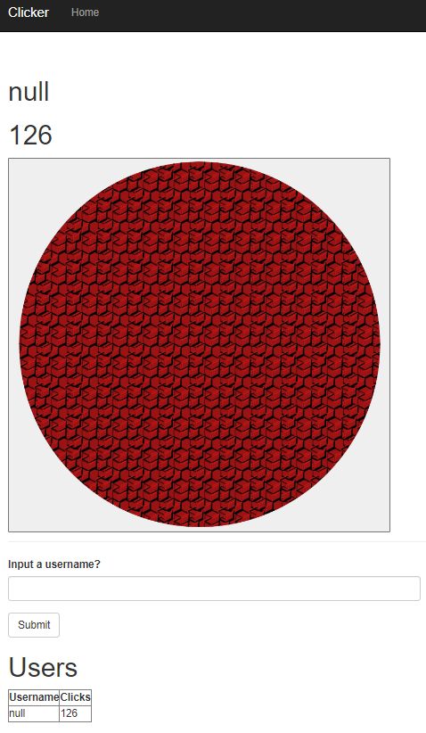

Clicker
===========

This website lets you click on a button, have your click be registered into a SQLAlchemy database, and then lets you have your updated number of clicks be displayed back to you by printing the entire database. If you wish, you can input a username, or let your clicks be associated with the null user. 

